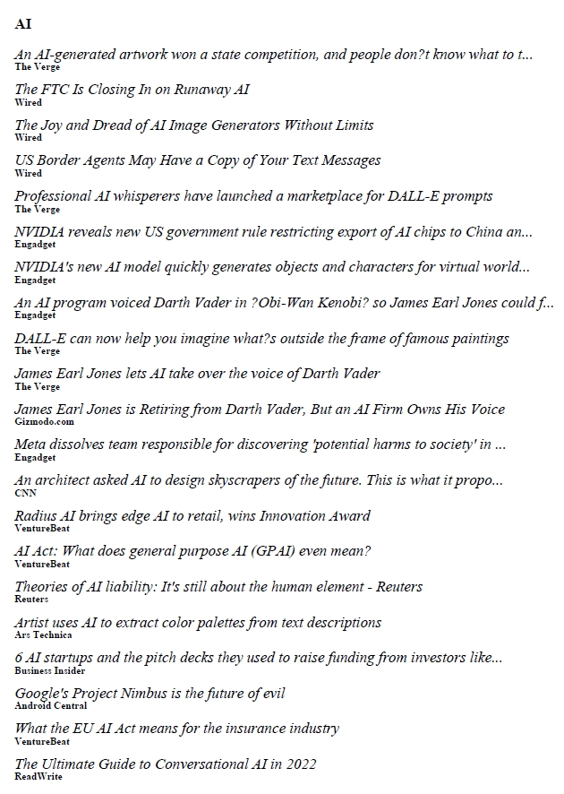

# NEWS PARSER

Allows you to download 100 headlines of any given topic.

#### Installation

`git clone https://github.com/roystonlmq/projects.git`

#### Requirements

`pip install requests`
 
`pip install git+https://github.com/PyFPDF/fpdf2.git@master`
 
[NewsAPI](https://newsapi.org/)
 Create config.py. In config.py, add:
 
`API_Key=123456789`

#### Demo
`python news.py --topic omicron --from 2022-07-20 
--to 2022-09-20 --source wsj.com --country us --f omicron_variant.pdf`

#### Image

